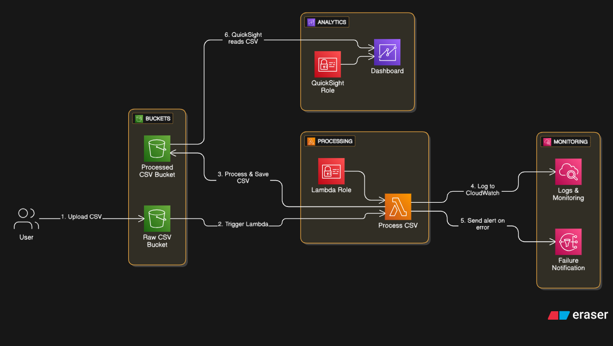

# Serverless AWS CSV Data Pipeline with S3, Lambda  pandas, and Amazon QuickSight 

A serverless AWS data pipeline that processes and cleans **CSV** files using **Lambda** and **pandas**, with secure **S3** access through **IAM roles** and lightweight deployment via **Lambda Layers**.

The processed CSV data is stored back in S3 and is ready for visualization in **Power BI** or **Amazon QuickSight**, enabling quick and flexible business insights.

---

## Example Use Case

Imagine a SaaS company tracking product sales across multiple countries.  
Raw CSVs uploaded to S3 often contain missing prices, inconsistent symbols like `$`, or text-based numbers.  
This pipeline automatically cleans that data and makes it ready for visualization.

---

## ⚙️ AWS Services Used

| Service | Purpose |
|----------|----------|
| **Amazon S3** | Stores raw and processed CSV files |
| **AWS Lambda** | Processes and cleans uploaded CSV data |
| **Python (pandas, boto3)** | data transformation |
| **Amazon CloudWatch** | Monitors logs and sends alerts |
| **Amazon SNS** | Sends failure notifications (optional) |
| **Amazon QuickSight** | Visualizes processed CSV data in dashboards |
| **IAM Roles** | Provides permissions for Lambda and QuickSight |

---

## Project Structure
```
csv-pipeline-project/
│
├── lambda_function.py                  # AWS Lambda code for CSV processing
├── requirements.txt                    # Python dependencies
├── README.md                           # Project documentation
│
├── data/
│     ├── sample_raw_data.csv           # Example raw input
│     └── sample_processed_data.csv     # Example cleaned output
│
├── processing/
|     └── architecture-diagram.png      # Optional AWS architecture diagram
└──
```

---

## 🔑 IAM Role Setup
**Create Role & Attach**  
   - **AmazonS3FullAccess** (or limited access to your specific bucket)
   - **CloudWatchLogsFullAccess** (for monitoring Lambda logs)

---

## 📁 Project Workflow Steps

1. **User Uploads CSV**
   - The user uploads a CSV file to the **Raw CSV S3 bucket**.

2. **Trigger Lambda Function**
   - The S3 upload event triggers an **AWS Lambda** function.

3. **Lambda Layer Setup for pandas**
   -  Use Prebuilt **Klayers**
   ex: ap-south-1 (Mumbai) region

   ```
   ARN: 
   arn:aws:lambda:ap-south-1:770693421928:layer:Klayers-p313-pandas:1
   ```

4. **Process and Save CSV**
   - The Lambda function reads the uploaded CSV, processes it (cleaning, filtering, formatting), and saves the processed output to the **Processed-CSV bucket**.

5. **Log and Monitor**
   - All events and execution details are logged in **Amazon CloudWatch** for monitoring.

6. **Error Handling**
   - If an error occurs, a **failure notification** is sent using AWS monitoring tool **SNS**.

7. **Data Visualization**
   - **Amazon QuickSight** reads the processed CSV from the S3 bucket and displays it in an interactive **dashboard** for analytics and reporting.

## Features

- Automatic CSV processing when files are uploaded to S3
- Detects columns like Sales, Profit, and Quantity
- Handles missing values safely
- Stores processed CSVs in a separate bucket for further use
- Compatible with Amazon QuickSight for visualization

## Architecture 

   

---

## Use Case :
This serverless pipeline can be used for:
1. Cleaning and standardizing sales or transaction CSVs  
2. Processing IoT sensor data files  
3. Preparing business data for visualization dashboards  
4. Automating ETL (Extract, Transform, Load) workflows  

## Author

**Satish Pathade**  
Software Developer | AWS Cloud & DevOps Engineer
[GitHub Profile](https://github.com/satishpathade)